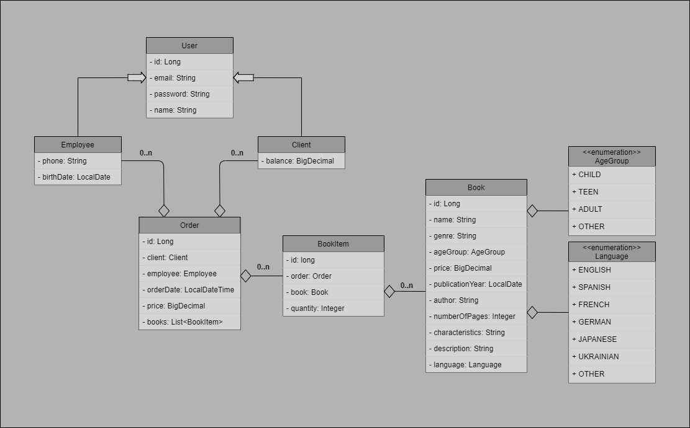
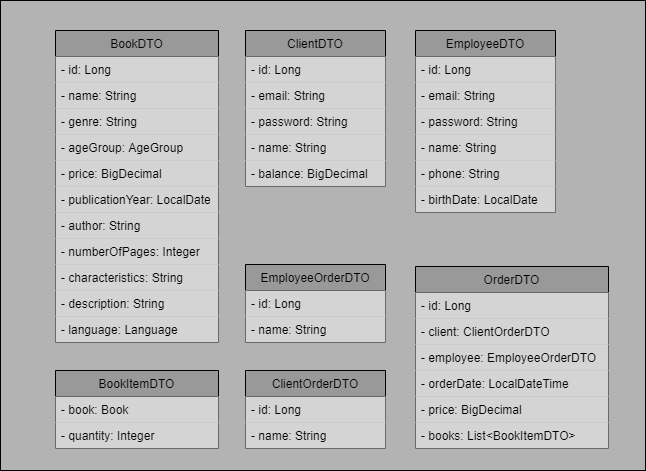

# Book Store. Spring Project

The purpose of this task is to check your knowledge and understanding in Java and Spring.

Duration: **15** hours

## Description

In this task, you will implement "Book Store Service" using MVC pattern. All the main classes are available and waiting
for you in the appropriate folders.

Your project is organized into several packages. Here's a brief overview of each:

#### `conf`

- All configuration classes are located here.

#### `controller`

- **`dto`**: Contains DTO files.
- **`error`**: Contains ErrorHandler file.
- **`impl`**: Contains implementations of all declared controllers.
- **`base`**: Contains interfaces with declared methods for all controllers.

#### `model`

- All model classes are located here.

#### `service`

- `exception`: Contains custom user exception files.
- `repo`: Contains repository files.
- `impl`: Contains implementations of all declared services.
- `base`: Contains interfaces with declared methods for all services.

The class diagram of the Domain model is shown in the figure below:

## Requirements

You should use and successfully implement next points:

- `Spring Data JPA`
- `Spring Security`
- `Internationalization and Localization`
- `Validation`
- `Error handling`
- `DTO` - data transfer objects with content provided below:

## Would be nice

- to have `Logging`
- to have `Pagination and Sorting`
- to use `Other Spring technologies`
- to use `Swagger API`

## Recommendations

- Use `Lombok`
- Use tools like `Postman` or `Insomnia`
- Use `ModelMapper`
- Use `Thymeleaf`
- Look into `test` folder. You can try to test your solution according to the provided test cases.
- Look into `main\resources\sql` folder. Here you can see SQL script for initializing data.

## Special message

1. Not forget to improvise and try to use different approaches while implementing your solution.
   Time is limited to 15 hours. Don't waste your time.

2. You should do as much as you can.
   We don't expect you to make a realization for all the points.
3. Have fun!
